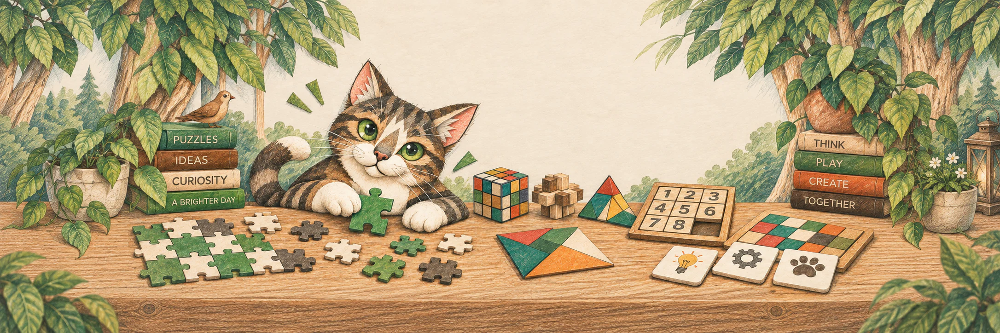
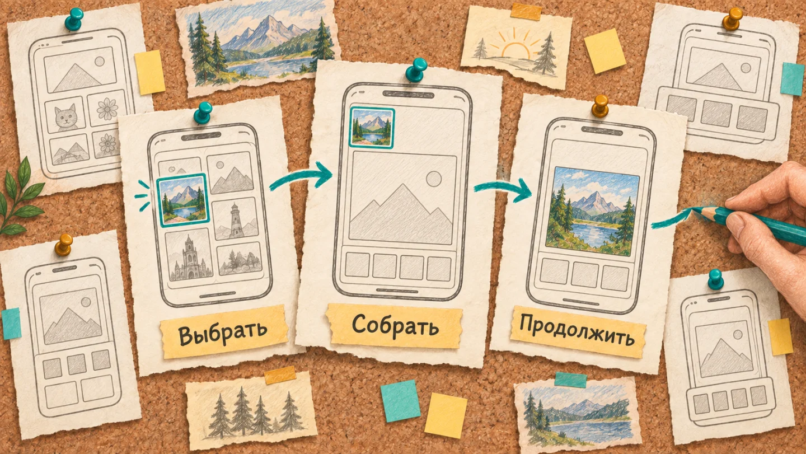
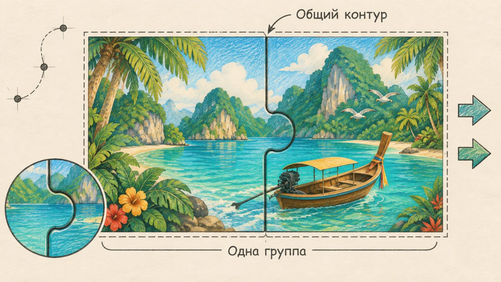
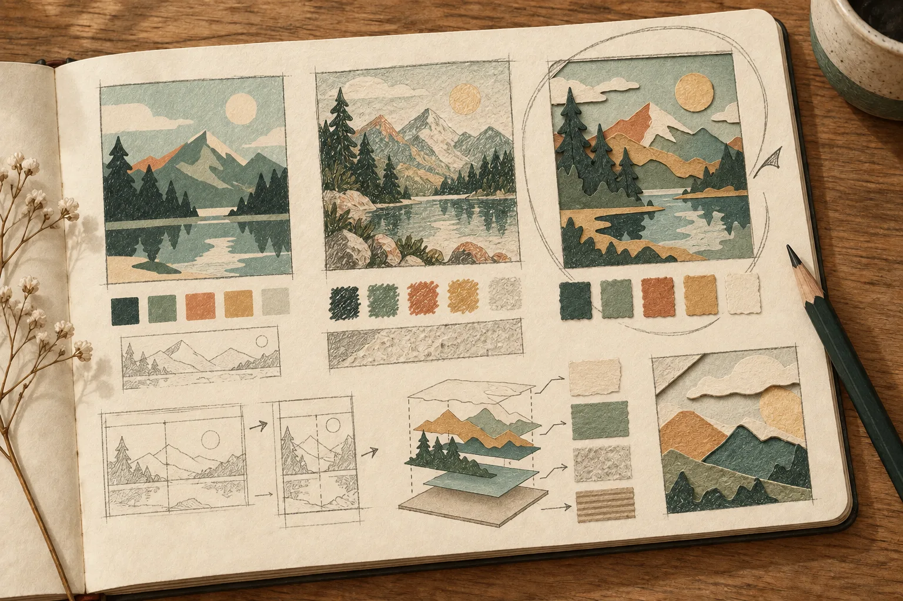
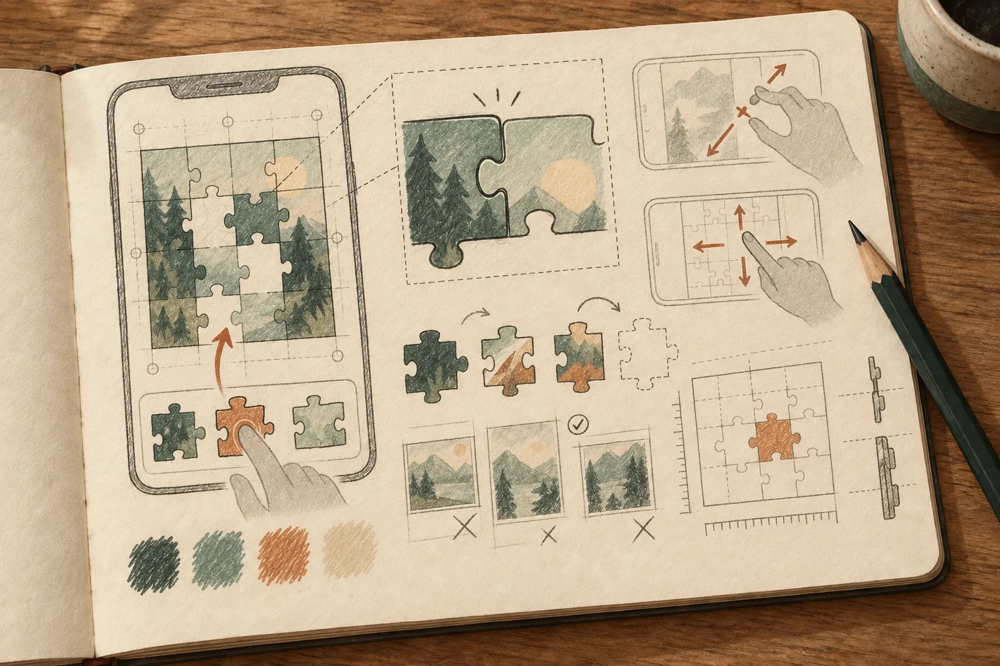
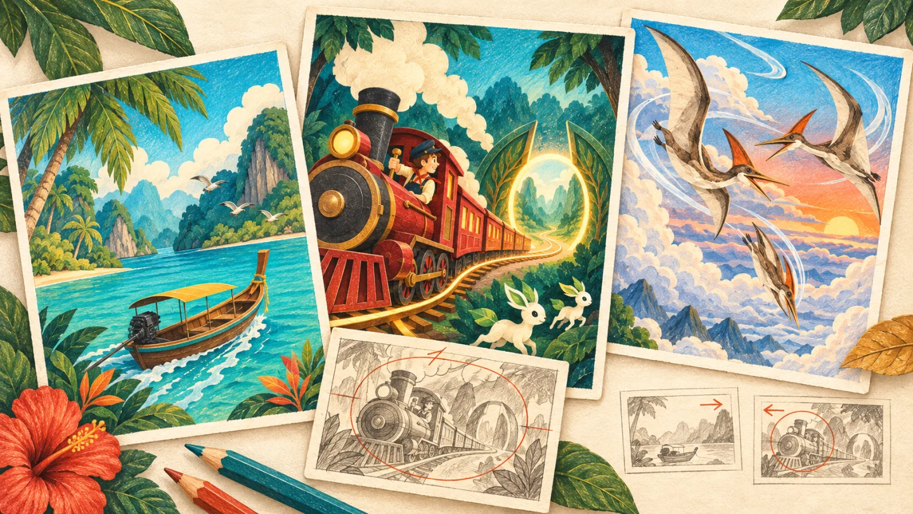
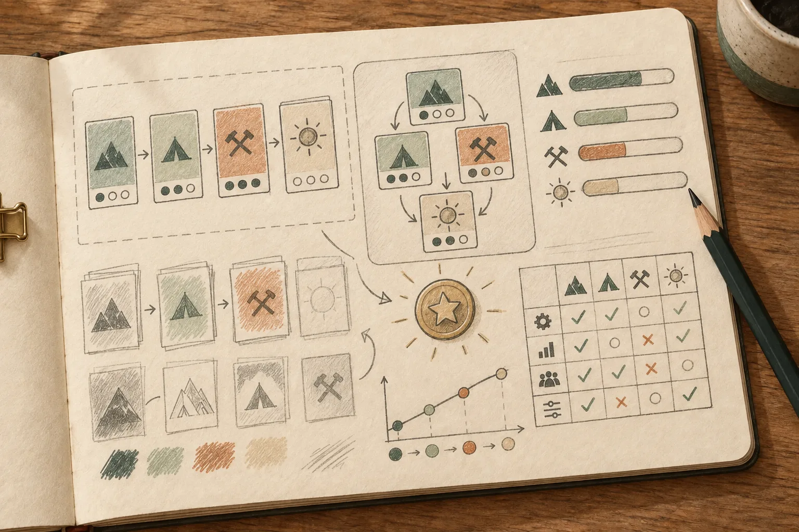
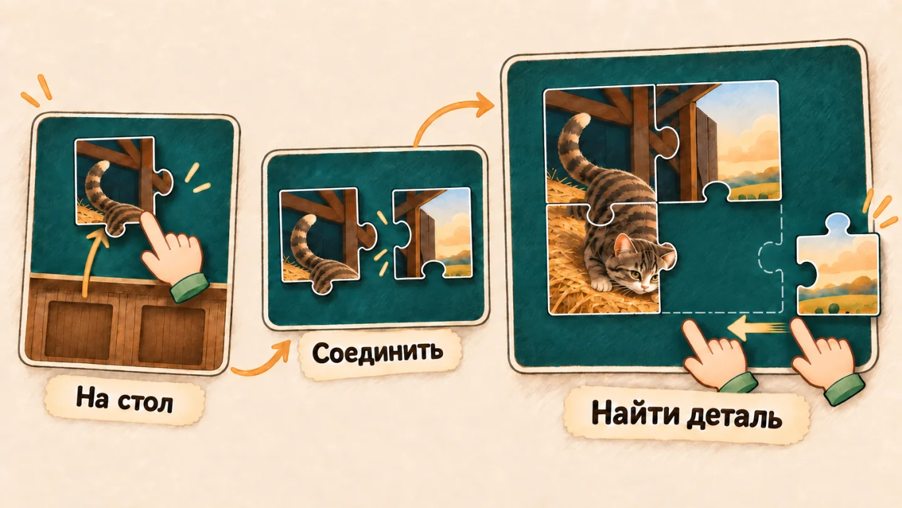
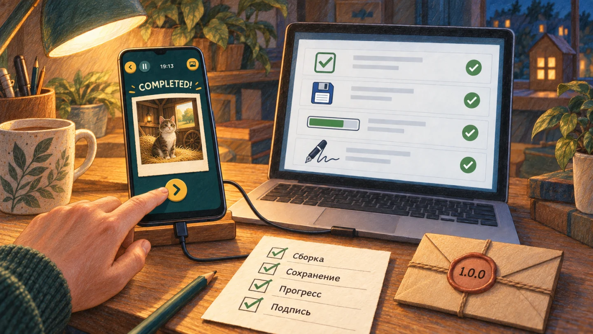

# Paperlore: Jigsaw

### От первого наброска до бумажного мира

История создания спокойной мобильной игры-головоломки от **[4iuaCraft Studios](https://4iuacraft.com/ru)**.

[Сайт студии](https://4iuacraft.com/ru) · [Дневник разработки](https://4iuacraft.com/ru/journal) · [Профиль автора](https://github.com/sergfila)

> Это публичный шоурум, а не репозиторий приложения. Здесь нет исходного кода, ключей подписи, рабочих конфигураций и внутренних материалов релизной сборки. Иллюстрации ниже — новые художественные эскизы истории разработки, а не скриншоты интерфейса.

## Идея

Paperlore выросла из простого принципа: пазл должен давать удовольствие от самого процесса, а не торопить игрока рекламой, покупками или искусственными ограничениями. Можно выбрать картинку и сложность, собирать в своём темпе и возвращаться к незавершённой работе.

## Путь игры

### 1. Сначала — идея и выбор направления

До кода мы разбирали пользовательский путь, альтернативы рабочей области и принцип offline-first. Ранние схемы были исследованием, а не готовым дизайном. Внутренний предпроектный пакет сохранился отдельно от этого шоурума.

**Проверка гипотезы:** сравнивали варианты пути от выбора сюжета до первой собранной детали; зафиксировали спокойный офлайн-сценарий как основу продукта.

### 2. Настоящие детали, а не сетка поверх картинки

В первых технических этапах появились геометрия деталей, перенос, попадание по контуру, прилипание к месту и сцепление соседей. Объединённые детали можно перемещать вместе — как в физическом пазле. Это основа всей последующей игры.

**Проверка гипотезы:** тестировали контуры, hit-test и сцепку по отдельности, прежде чем переносить их в полноценный игровой экран.

### 3. Поиск бумажного языка

Мы искали не просто набор красивых картинок, а узнаваемую технику: крупные цветовые плоскости, бумажные слои, читаемый сюжет и текстуры, которые не мешают сборке. «Через лагуну» стала визуальным ориентиром; позднее коллекцию пересмотрели, чтобы старые и новые работы говорили на одном языке.

**Проверка гипотезы:** сопоставляли разные плотности текстур и композиции; слишком дробные поверхности отвергали как неудобные для пазла.

### 4. Из лаборатории — в игру

Рабочая область получила масштабирование, перемещение, ленту деталей, перенос на стол, поворот и завершение сборки. Затем появились продуктовые экраны и устойчивое сохранение сессии. Мы проверяли жесты на настоящем Android-устройстве, включая большие пазлы.

**Проверка гипотезы:** руками проходили цепочку «лента → стол → сцепление → завершение» и отдельно исправляли мерцание и задержки жестов.

### 5. Миры, которые хочется открывать

Коллекция постепенно расширялась: животные, путешествия, еда, города, спорт и другие сюжеты; позднее к ней присоединились фэнтези, динозавры, машины, цивилизации и будущее. Во время художественного аудита мы убирали повторяющиеся композиции, слишком мелкие текстуры и сюжеты, которые плохо читаются как пазл.

**Проверка гипотезы:** сравнивали миниатюры рядом, проверяя различимость силуэтов, масштаб персонажей и разнообразие переднего плана.

### 6. Прогресс без давления

Собранные картинки попадают в коллекцию, категории открываются через игру, а достижения отмечают реальные открытия. Прогресс должен быть понятным, но не превращаться в навязчивую гонку. Важные состояния проверялись и вручную, и автоматическими тестами.

**Проверка гипотезы:** автоматическим сценарием прошли цепочку открытия категорий и уточнили, что именно показывает счётчик до следующей категории.

На иллюстрации — конкретный пример действующего правила: пять разных собранных картинок «Путешествий» открывают «Еду». Повторная сборка одного сюжета не заменяет новый сюжет для этого порога.

### 7. Обучение прямо во время сборки

Вместо отдельного учебного экрана мы встроили пошаговую тренировку в игровой процесс: взять деталь из ленты, положить на стол, повернуть, соединить, управлять масштабом и сдвинуть поле. После первого знакомства обучение можно запустить снова из паузы.

**Проверка гипотезы:** несколько раз перестраивали раскадровку после ручного теста — особенно перенос сцепленной группы и движение поля двумя пальцами.

### 8. Подготовка к первому выпуску

Последний отрезок — надёжность сохранений, производительность, релизная подпись, политика конфиденциальности, контакты, заставка и проверка финальной Android-сборки на Pixel 7. На 28 сентября 2026 года версия 1.0.0 отправлена в RuStore и проходит модерацию. После публикации обновим здесь прямую ссылку на игру.

**Проверка гипотезы:** релизный пакет и подпись сверены отдельно от debug-сборки; финальные сценарии сборки и прогрессии проверены на телефоне.

## Принципы, которые мы сохранили

- Игра работает офлайн и уважает время игрока.
- Нет рекламы, донатов и платных преимуществ.
- Сюжет картинки должен быть интересным, ясным и удобным для сборки.
- Каждая деталь взаимодействует с полем как физический объект.
- Ручная проверка на устройстве дополняет автоматические тесты.

## Об иллюстрациях

Иллюстрации восьми глав созданы специально для этого рассказа в карандашной стилистике сайта 4iuaCraft Studios. В их основе — реальные сюжеты, интерфейс и решения проекта; композиции реконструированы, а экраны упрощены для объяснения механик. Это не архивные макеты и не скриншоты релизной игры. [Описание иллюстраций и постановка задач](ARTWORK.md).

Автор игры и руководитель проекта — **Sergey Filippov**; команда разработки использует **OpenAI Codex** как инструмент и инженерного помощника.

Связь: [support@4iuacraft.com](mailto:support@4iuacraft.com) · [4iuacraft.com](https://4iuacraft.com)

© 2026 Sergey Filippov / 4iuaCraft Studios. Материалы и изображения — для ознакомления; лицензия на повторное использование не предоставляется.
